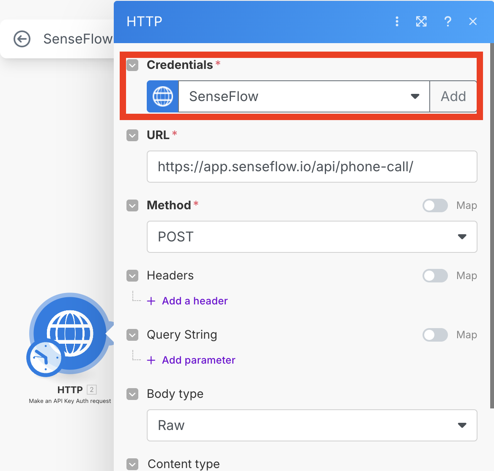
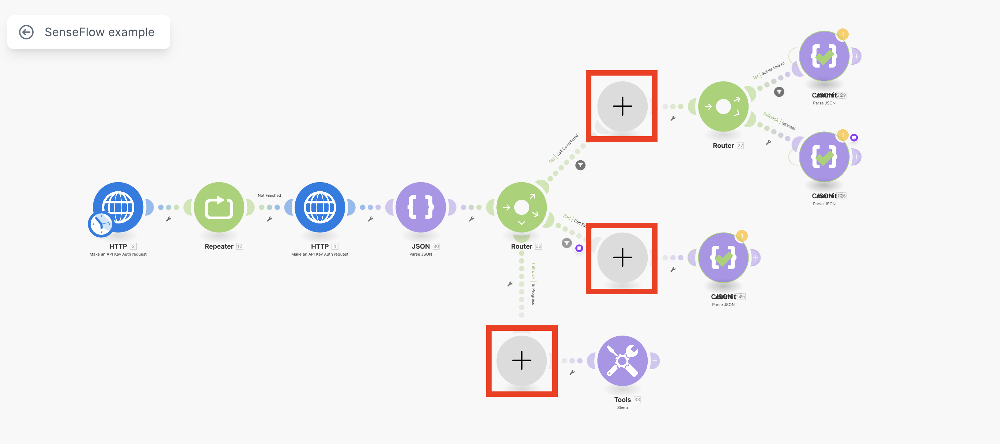

# SenseFlow <> Make.com Integration

This guide provides a simple blueprint for using SenseFlow API endpoints to make phone calls via [Make.com](https://www.make.com).

---

## 🚀 Getting Started

Follow these steps to integrate SenseFlow with your Make.com scenario:

### 1. Start a New Scenario

Begin by creating a new scenario in your [Make.com dashboard](https://www.make.com).

### 2. Import the Blueprint

You can either:
- Import the provided blueprint manually, **or**
- Start directly from this template: [SenseFlow Example Template](https://www.make.com/en/integration/16304-senseflow-example?templatePublicId=16304)

### 3. Sign Up for SenseFlow

- Go to [SenseFlow](https://app.senseflow.io)
- Create an account and obtain your **API key**

### 4. Configure HTTP Modules

- Create a new **Secret** in Make.com using your SenseFlow API key
- Use this secret in the two HTTP modules  
  

### 5. Customize the Payload

Update the request body with your own information. Example payload:

```json
{
  "to_number": "+420777777777",
  "language": "en",
  "first_message": "Hi Bob, this is Alice from ACME Corp.",
  "on_behalf_of": "Alice Johnson",
  "goal": "Book a 30-minute partnership meeting with Bob next week.",
  "context": "Caller: Alice Johnson, Sales Manager at ACME Corp. Callee: Bob Smith, CTO at Beta Inc. They met last week at TechConf and discussed potential partnership opportunities. Availability: Alice is free Tue–Thu next week between 10:00 and 14:00 CET. Preferred location: Beta Inc. HQ in Prague or video call if Bob prefers remote. Tone: Friendly yet professional. Please confirm a suitable time and send a calendar invite if possible."
}
```

### 6. Add your business logic here
⚠️ Do not run the flow without actual nodes instead of the blanks - the logic breaks smh.


## Notes
- The commit and JSON parse exceptions are used to escape the repeater and simulate a do-while loop structure.
